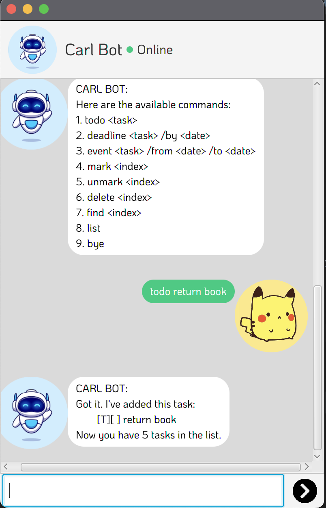

# User Guide

CarlBot is a Personal Assistant Chatbot that helps a person to keep track of various things. Carl Bot is created using Java that aids user to keep tracks of todo, deadline and events.  

## Quick start
1. Ensure you have Java `11` or above installed in your Computer.
2. Download the latest `CarlBot.jar` from here.
3. Copy the file to the folder you want to use as the _home_ folder for your chatbot.
4. Open a command terminal, cd into the folder you put the jar file in, and use the `java -jar CarlBot.jar` command to run the application. A GUI similar to the below should appear in a few seconds. Note how the app contains some sample data. <br> 
5. Type the command in the command box and press Enter to execute it. e.g. typing `help` and pressing Enter will show all the commands.
6. Refer to the Features below for details of each command.

## Features 

### Addition of Task

Users are able to add todo, deadline and event tasks into the chatbot which will be locally stored on your computer.

### Marking and unmarking tasks

Users are able to mark tasks that are done or unmark tasks.

## Usage

### `help` - Views help of Carl Bot

Displays all the available commands.

Format: `help`


### `todo` - Adds a todo task

Adds a todo task that is a task without any date/time attached to it.

Format: `todo [task]`

Example of usage: 

`todo borrow book`

Expected outcome:

Carl Bot will respond saying it has added your task.

```
Got it. I've added this task:
    [T][ ] borrow book
Now you have 5 tasks in the list.
```

### `deadline` - Adds a deadline task

Adds a deadline task that is a task that need to be done before a specific date/time e.g., submit report by 11/10/2019 5pm.

Format: `deadline [task] /by [deadline]`

Example of usage: 

`deadline return book /by Sunday`

Expected outcome:

Carl Bot will respond saying it has added your task.

```
Got it. I've added this task:
    [D][ ] return book (by: Sunday)
Now you have 6 tasks in the list.
```

### `event` - Adds an event task

Adds an event task that is a task that start at a specific date/time and ends at a specific date/time
e.g., (a) team project meeting 2/10/2019 2-4pm (b) orientation week 4/10/2019 to 11/10/2019.

Format: `event [task] /from [YYYY-MM-DD HH:MM] /to [YYYY-MM-DD HH:MM]`

Example of usage: 

`event project meeting /from 2019-09-02 18:00 /to 2019-09-02 19:00`

Expected outcome:

Carl Bot will respond saying it has added your task.

```
Got it. I've added this task:
    [E][ ] project meeting (from: Mon 2pm to: 4pm)
Now you have 7 tasks in the list.
```

### `mark` - Mark tasks as done

Mark tasks as done.

Format: `mark INDEX`

Example of usage: 

`mark 2`

Expected outcome:

Carl Bot will mark the task with the index as done.

```
OK, I've marked this task as done:
    [ ] return book
```

### `unmark` - Unmark tasks as not done

Unmark tasks as not done yet.

Format: `unmark INDEX`

Example of usage: 

`unmark 2`

Expected outcome:

Carl Bot will unmark the task with the index as not done yet.

```
OK, I've marked this task as not done yet:
    [ ] return book
```

### `delete` - Deletes a task

Deletes a task from the list.

Format: `delete INDEX`

Example of usage: 

`delete 3`

Expected outcome:

Carl Bot will respond saying it has removed your task.

```
Noted. I've removed this task:
    [E][ ] project meeting (from: Aug 6th 2pm to: 4pm)
Now you have 4 tasks in the list.
```

### `find` - Finds a task

Find a task by searching for a keyword.

Format: `find KEYWORD`

Example of usage: 

`find book`

Expected outcome:

Carl Bot will display all the tasks with the keyword `book`.

```
Here are the matching tasks in your list:
    1.[T][X] read book
    2.[D][X] return book (by: June 6th)
```

### `list` - Lists all the task

Displays all the tasks stored in Carl Bot

Format: `list`

Expected outcome:

Display of all the tasks stored.

```
Here are the tasks in your list:
1.[T][X] read book
2.[D][ ] return book (by: Sep 02 2019 18:00)
3.[E][ ] project meeting (from: Sep 02 2019 18:00 to: Sep 02 2019 19:00)
4.[T][ ] CS2103T tutorial
```

### `bye` - Exits the program

Exits the program.

Format: `bye`

Expected outcome:

Program will close.
